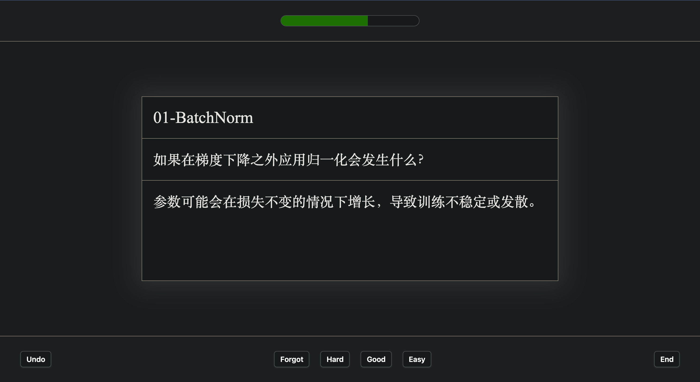
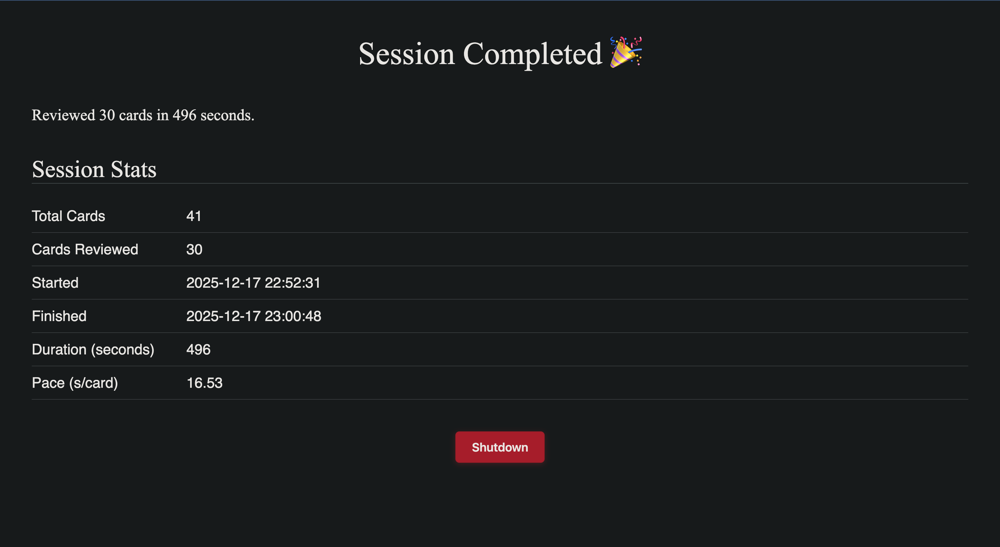

# hashcards

A local-first spaced repetition learning application, inspired by Anki and Mochi.



## Philosophy

hashcards is built on four core principles:

1. **Unix Philosophy** - Small, composable tools working with text streams
2. **Open Source Spirit** - Transparent, controllable, shareable
3. **Cognitive Engineering** - Minimize friction, optimize workflow
4. **Data Sovereignty** - You own your data

## Key Features



- 📝 **Markdown-based cards** - Your cards are just `.md` files
- 🔍 **Content-addressable** - Cards identified by hash, not arbitrary IDs
- 🧠 **FSRS scheduling** - State-of-the-art spaced repetition algorithm
- ⚡ **Minimal friction** - Simple syntax, keyboard-driven interface
- 🔧 **Git-friendly** - Track changes, share decks, collaborate
- 🎯 **No database lock-in** - Cards in plain text, schedules in SQLite

## Installation

```bash
# Clone the repository
git clone https://github.com/1998x-stack/interview_hashcards.git
cd interview_hashcards

# Install dependencies
pip install -r requirements.txt

# Install interview_hashcards
pip install -e .
```

## Quick Start

### 1. Create your first deck

Create a directory for your cards and add a Markdown file:

```bash
mkdir Cards
cd Cards
```

Create `Math.md`:

```markdown
Q: What is the derivative of x²?
A: 2x

Q: What is the integral of 1/x?
A: ln|x| + C

C: The quadratic formula is [x = (-b ± √(b² - 4ac)) / 2a].

C: Euler's identity: [e^(iπ)] + [1] = [0].
```

### 2. Start studying

```bash
hashcards drill ./Cards
```

This opens a web interface at `http://localhost:8000` where you can review cards.

### 3. Use keyboard shortcuts

- **Space** - Show answer
- **1** - Again (< 10 minutes)
- **2** - Hard (~80% of normal interval)
- **3** - Good (normal interval)
- **4** - Easy (~130% of normal interval)

## Card Format

### Question-Answer Cards

```markdown
Q: What is the capital of France?
A: Paris
```

### Cloze Deletion Cards

```markdown
C: The mitochondria is the [powerhouse] of the [cell].
```

Each `[...]` creates a separate card testing that deletion.

## Project Structure

```
hashcards/
├── hashcards/
│   ├── __init__.py
│   ├── parser.py          # Parse Markdown cards
│   ├── scheduler.py       # FSRS scheduling algorithm
│   ├── storage.py         # SQLite database management
│   ├── hasher.py         # Content-addressable hashing
│   ├── cli.py            # Command-line interface
│   └── web/
│       ├── app.py        # Flask application
│       └── templates/    # HTML templates
├── setup.py
├── requirements.txt
└── README.md
```

## CLI Commands

```bash
# Start study session
hashcards drill <cards_directory>

# Show statistics
hashcards stats <cards_directory>

# Validate card syntax
hashcards validate <cards_directory>
```

## Advanced Usage

### Unix Pipeline Magic

Since cards are plain text, you can use standard Unix tools:

```bash
# Count total cards
grep -c "^Q:" Cards/*.md

# Find cards about a topic
grep -B1 "mitochondria" Cards/*.md

# List all decks
ls Cards/*.md

# Word count
wc -w Cards/*.md
```

### Git Integration

```bash
# Initialize Git repository
cd Cards
git init

# Track your learning journey
git add .
git commit -m "Added organic chemistry deck"

# Share on GitHub
git remote add origin https://github.com/1998x-stack/my-cards.git
git push -u origin main
```

### Scripted Card Generation

Create cards from structured data:

```python
import csv

# Generate vocabulary cards from CSV
with open('vocab.csv') as f:
    reader = csv.DictReader(f)
    with open('Cards/French_Vocab.md', 'w') as out:
        for row in reader:
            out.write(f"Q: What is '{row['english']}' in French?\n")
            out.write(f"A: {row['french']}\n\n")
```

## Design Decisions

### Why No Database for Cards?

Traditional flashcard apps store everything in a database. This creates problems:

- **Vendor lock-in** - Can't easily migrate or process your data
- **Opaque format** - Can't use standard tools
- **Difficult to version control** - No Git integration
- **Harder to share** - Can't just send someone a file

hashcards solves this by storing cards as Markdown files. Only the *scheduling state* (when to review each card) goes in SQLite - and that's ephemeral data you can always rebuild.

### Why Content-Addressable?

Cards are identified by their content hash, not a database ID. This means:

- **Automatic deduplication** - Same content = same card
- **Safe editing** - Changing a card creates a new one
- **Git-friendly** - Easy to track what changed
- **No ID collisions** - Merge conflicts are content conflicts

### Why FSRS Over SM-2?

FSRS (Free Spaced Repetition Scheduler) is the state-of-the-art algorithm:

- More accurate predictions than SM-2
- Better handling of forgotten cards
- Adaptive to individual card difficulty
- Used by modern Anki

Unlike simpler algorithms, FSRS doesn't just multiply intervals - it models memory decay curves.

## Comparison to Other Tools

| Feature | hashcards | Anki | Mochi |
|---------|-----------|------|-------|
| Card format | Markdown files | Database | Database |
| Version control | Git native | Plugin required | Not available |
| Scheduling | FSRS | FSRS (with addon) | Simple multiplier |
| Syntax | Minimal | WYSIWYG | Markdown + verbose |
| Data ownership | Full | Full | Limited |
| Learning curve | Medium | High | Low |

## Contributing

Contributions welcome! This project follows these principles:

- Keep it simple
- Respect Unix philosophy
- Maintain data sovereignty
- Minimize user friction

## License

MIT License - see LICENSE file

## Acknowledgments

- Inspired by [Anki](https://apps.ankiweb.net/) and [Mochi](https://mochi.cards/)
- FSRS algorithm by [open-spaced-repetition](https://github.com/open-spaced-repetition)
- Idea of content-addressable cards from Andy Matuschak's note system

## Philosophy

> "Your flashcard collection is important. It should be yours - stored in plain text, tracked by Git, editable with any tool. The application is just a view into your data, not a prison for it."

hashcards is designed for people who:

- Value their data and want full control
- Like working with plain text and Unix tools
- Want to track their learning in Git
- Appreciate minimal, keyboard-driven interfaces
- Believe in the open web and data portability